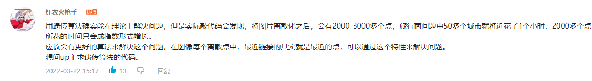

### 一笔画校徽
此项目受B站up主@图通道，（傅里叶级数）超然可视化，动态打印交大校徽的启发。 实现了部分功能，特将此开源，供大家学习参考


### 操作说明

1. 下载安装matlab1. 
2. 在“检测切割图像”文件夹中,打开"step1test3.m"文件，在

```
or_data=imread('原图像2.png');
```
修改imread参数（设置为你自己的图片）  
3. 遗传/退火算法做法：  
遗传：  
(1). 运行"GA_TSP.m"文件，得到"sol_best_GA.m"最优路径  
（2）运行"draw2.m",生成"test.gif"所得的一笔画校徽的动图；或者运行”draw.m”，生成"test.mp4"所得一笔画校徽的视频文件  
退火：  
（1）运行"main.m"文件，以下同  
（2）或者选择最小距离画图做法，不用执行退火/遗传算法，但需执行1，2步骤  
最小距离：  
（1）运行"mindot.m"文件,以下同(2)


### TIPS
1. 笔者按up主，用遗传算法来获取最优路径时，发现遗传算法不仅慢，计算量大，而且计算结果差（难道up主是数学建模高手，论文用遗传，实际用迭代（狗头保命）），所以不禁发出这样的评论。

这其实就是最小距离算法的核心
2. 一笔画校徽有缺陷，这里似乎牵扯到拓扑学的内容,对于没有连通的图像效果似乎不太好
3. 希望大家来多多捧场


